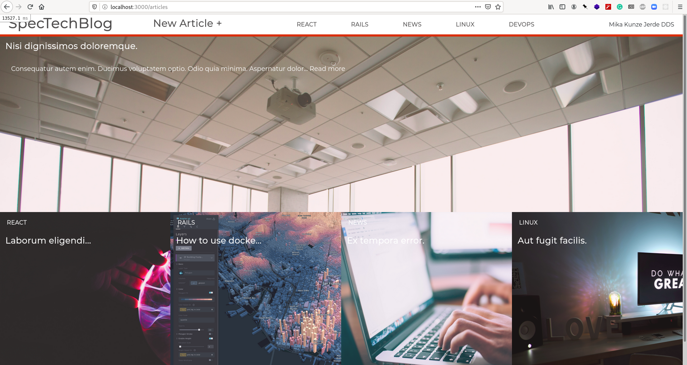

# SpecTech Blog

> Microverse Capstone project. A Technology blog app with multiple articles, voting features, image uploading and a nice grid layout. DESKTOP APP ONLY.*



This project adds markdown rendering to improve writing experience for users.

## Built With

- Ruby 2.7.3
- Rails 6.1.3
- PostgreSQL
- Webpack and Yarn for Javascript

# Featured gems

- Redcarpet
- Faker
- FactoryBot
- Solargraph (for smooth development)

## Live Demo

Check out the heroku development deployment [here](https://spectech-blog.herokuapp.com)


## Getting Started

To get a local copy up and running follow these simple example steps.

### Before Steps

Create a AWS3 key to store your own images in a bucket (for development).

Setup the application with the following commands:

```
bundle install
```

Then configure and seed the database with:

```
rails db:create db:migrate db:seed
```


### Usage

For local development fire up the server in `localhost:3000` using:
```
rails s
```

### Test the application

You can make sure everything is fine by using the following command:
```
rspec
```

### Deployment


## Authors

👤 **Angel Mora**

- Github: [@angel-mora](https://github.com/angel-mora)
- Linkedin: [@angelmoradev](https://linkedin.com/angelmoradev)

## 🤝 Contributing

Contributions, issues and feature requests are welcome!

Feel free to check the [issues page](issues/).

You can also submit a Pull Request if you have a major feature or fix you'd like to add.

## Show your support

Give a ⭐️ and share if you like this project!

## Acknowledgments

- Thanks to Microverse!
- Check out the original design [here](https://www.behance.net/gallery/14554909/liFEsTlye-Mobile-version)
- Remember to credit every work you use!

## 📝 License

This project is based on [Creative Commons](https://creativecommons.org/licenses/by/2.0/) licensed and inherits from its license.

